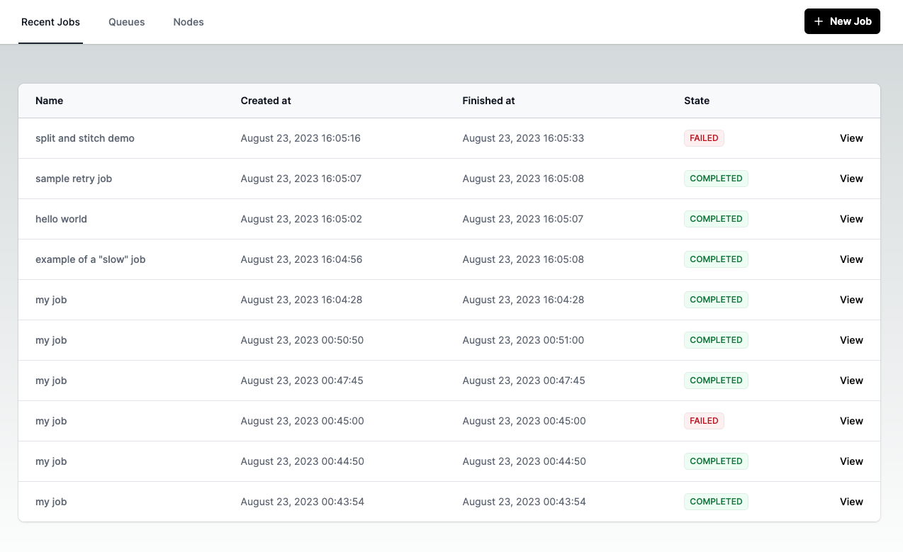

A web UI for the [Tork](https://github.com/runabol/tork) Workflow Engine.



## Getting Started

First, run the development server:

```bash
npm install
npm run dev
```

Open [http://localhost:3000](http://localhost:3000) with your browser to see the application.

## Configuration

Default configuration can be found at [.env.development](.env.development).

You can override the default configuration by creating an `.env.local` file.
