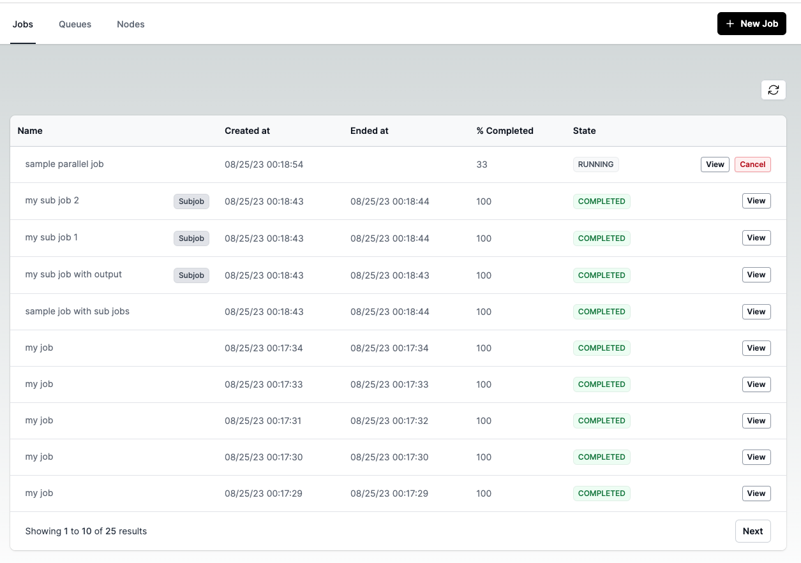
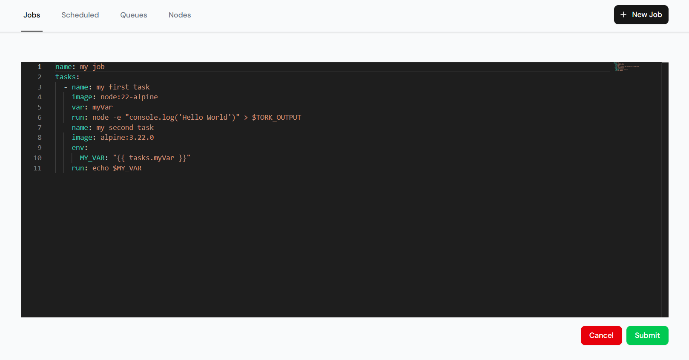
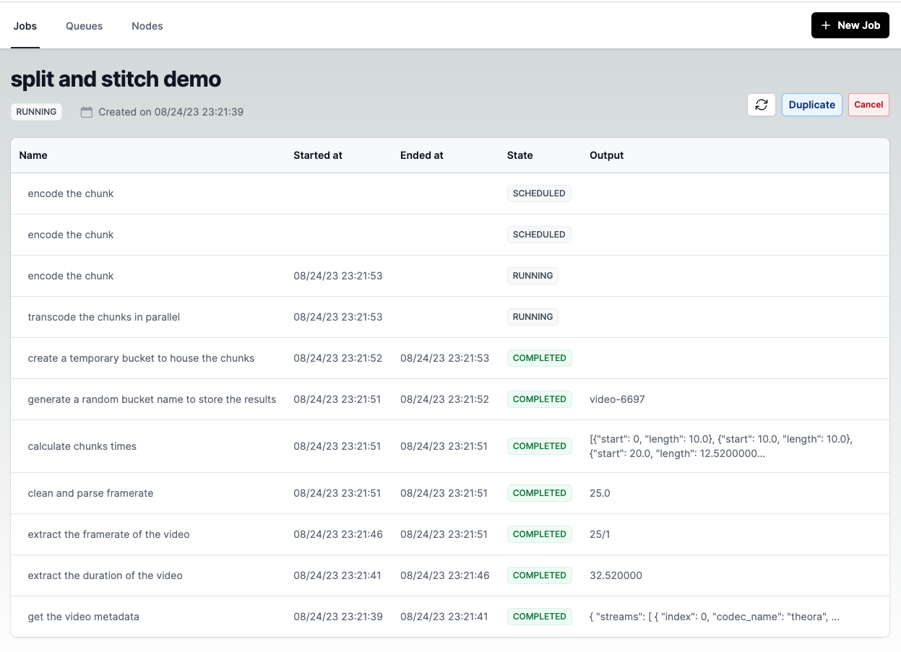

## Tork UI

A web UI for the [Tork](https://github.com/runabol/tork) Workflow Engine.

## Screenshots

List Jobs:



Create Job:



View Job:



## Getting Started

First, run the development server:

```bash
npm install
npm run dev
```

Open [http://localhost:3000](http://localhost:3000) with your browser to see the application.

## Configuration

Default configuration can be found at [.env.development](.env.development).

You can override the default configuration by creating an `.env.local` file.

## TODO

1. Show node status
2. Add a drop-down of sample jobs on New Job page.
3. Job stats

## License

Copyright (c) 2023-present Arik Cohen. Tork and Tork Web is free and open-source software licensed under the MIT License.
