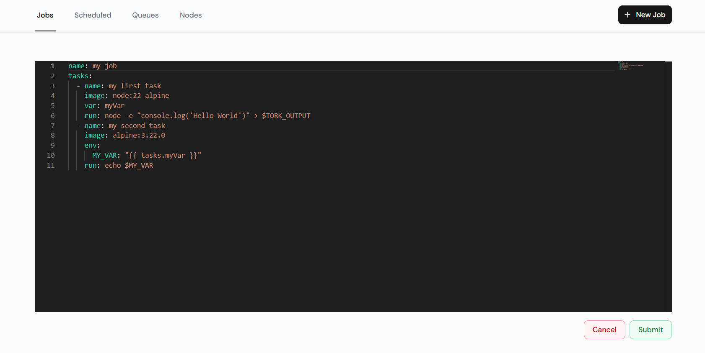
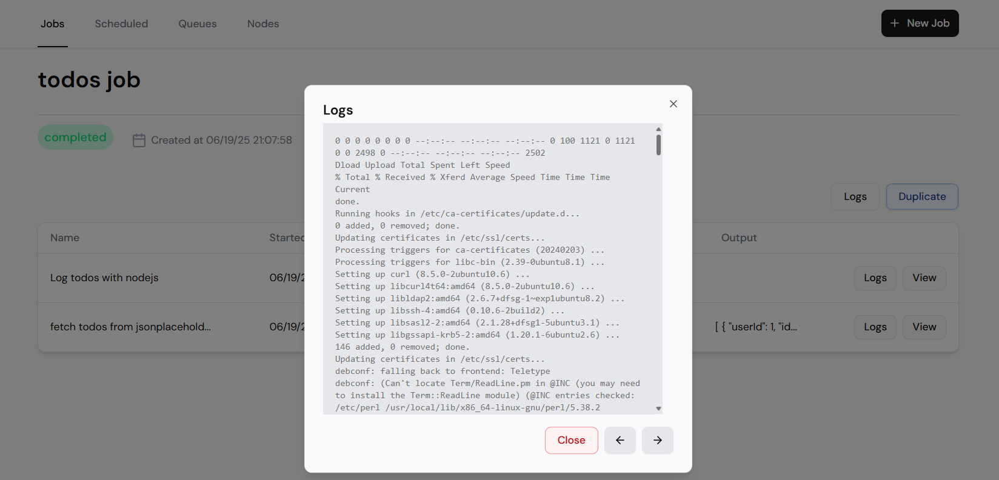

## Tork UI

A web UI for the [Tork](https://github.com/runabol/tork) Workflow Engine.

---

### Getting Started

Once you have this repo cloned to your local system, you will need to install the VSCode extension [Remote Development](https://marketplace.visualstudio.com/items?itemName=ms-vscode-remote.vscode-remote-extensionpack).

Then run the following command from the command palette:
`Dev Containers: Open Folder in Container...`

This will automatically select the workspace folder. But if you need to find the project manually then it is located at `/workspaces/tork-web`.

### Development

Once you're in the devcontainer, run the following commands:

```bash
npm install
npm run dev
```

Open [http://localhost:3000](http://localhost:3000) with your browser to see the application.

---

### Docker

```bash
docker run \
  -it \
  --rm \
  --name=tork-web \
  -p 3000:3000 \
  -e BACKEND_URL=http://host.docker.internal:8000 \
  runabol/tork-web
```

---

### Configuration

Default configuration can be found at [.env.development](.env.development).

You can override the default configuration by creating an `.env.local` file.

---

### Screenshots

List Jobs:


Create Job:



View Job:


Task Logs:



---

### License

Copyright (c) 2023-present Arik Cohen. Tork and Tork Web is free and open-source software licensed under the MIT License.

---
